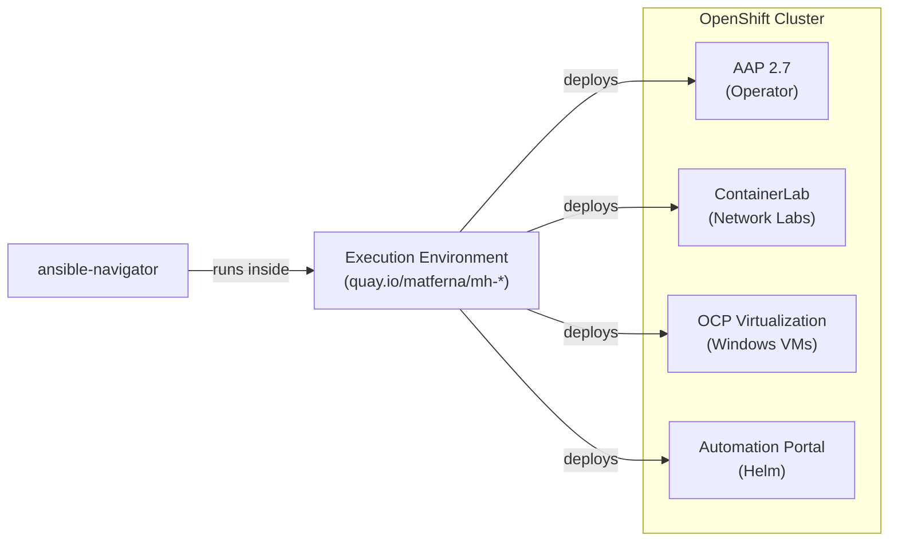
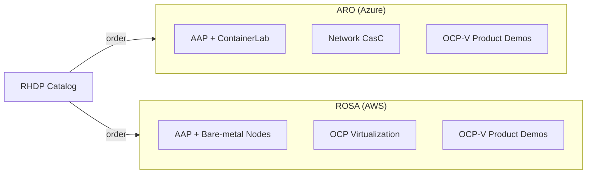
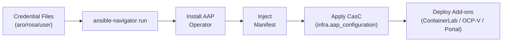
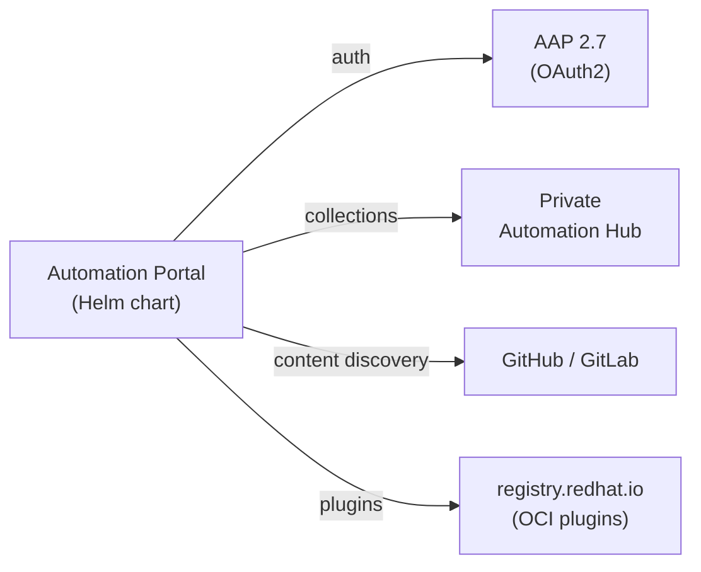

# Mad Hatter

## Ansible-Driven AAP on OpenShift Deployer

<!-- Speaker notes: Mad Hatter deploys a complete AAP 2.7 environment on OpenShift (ARO or ROSA) with optional add-ons — all from a single ansible-navigator command. -->

---

# Problem Statement

## Deploying AAP on OpenShift is complex and manual

- AAP operator installation requires multiple manual steps
- Configuration as Code setup is time-consuming and error-prone
- Add-ons (ContainerLab, OCP-V, Portal) each have their own deployment process
- Demo environments need to be reproducible and fast to stand up
- AAP 2.7 introduces breaking changes (gateway API, new collections)

<!-- Speaker notes: Before Mad Hatter, standing up a fully-configured AAP environment with networking labs, Windows VMs, and a self-service portal took hours of manual work. Now it's one command. -->

---

# Solution

## One command deploys everything

- `ansible-navigator run deploy_aro.yml` — complete AAP on Azure
- `ansible-navigator run deploy_rosa.yml` — complete AAP on AWS
- Tag-based component selection (`--tags aap,clab,apd,ocpv`)
- Pre-built Execution Environments on Quay.io
- Supports AAP 2.7 gateway API and `ansible.platform` collection
- Fully declarative — credential files + one playbook

<!-- Speaker notes: The key insight is composability via tags. Need just AAP? One tag. Need AAP plus networking labs? Two tags. Everything? No tags. -->

---

# Architecture

<!-- Speaker notes: ansible-navigator runs inside a purpose-built EE that contains all required tools (oc, helm, ansible collections). The EE deploys all components to the target OpenShift cluster. -->

---

# Supported Platforms

<!-- Speaker notes: Both platforms are ordered from the Red Hat Demo Platform catalog. ARO is Azure-based with ContainerLab for networking. ROSA is AWS-based with bare-metal nodes for real virtualization. -->

---

# Deployment Flow

<!-- Speaker notes: Credential files are parsed from RHDP output. The playbook handles operator install, manifest injection, CasC application, and add-on deployment in sequence. -->

---

# Automation Portal

<!-- Speaker notes: The Automation Portal provides a self-service UI for building EEs, browsing content, and generating playbooks. It integrates with AAP via OAuth2 and pulls plugins as OCI artifacts. -->

---

# Tag-Based Component Selection

## Compose your environment with tags

- `--tags aap` — AAP operator + manifest only
- `--tags aap,clab` — add ContainerLab networking labs
- `--tags aap,ocpv` — add bare-metal nodes for OCP Virtualization
- `--tags aap,apd` — add Ansible product demo CasC
- `--tags aap,clab,apd` — networking labs + product demos
- No tags — deploy everything

<!-- Speaker notes: This is the composability story. Each tag is independent and idempotent. You can add components later by re-running with additional tags. -->

---

# AAP 2.7 Support

## Breaking changes handled transparently

- **Platform gateway** is the sole API entry point (no direct `/api/v2/`)
- CasC authenticates via gateway OAuth tokens (`ansible.platform.token`)
- `ansible.platform` collection replaces deprecated `ansible.hub`
- OCI plugin delivery from `registry.redhat.io`
- Operator channel defaults to `stable-2.7` (override for older clusters)

<!-- Speaker notes: AAP 2.7 is a significant architectural change. Mad Hatter abstracts all of this — users don't need to know about gateway routing or collection migration. -->

---

# Roles

## Modular, reusable components

- **aap_operator** — installs AAP operator, waits for readiness, injects manifest
- **clab** — deploys ContainerLab with multi-vendor network topologies
- **openshift_virtualization_aap** — provisions bare-metal machinepool + OCP-V
- **self-service** — deploys Automation Portal via Helm (OAuth, secrets, plugins)
- **aro_creds / rosa_creds / user_creds** — parse platform-specific credentials
- **install_operator** — generic OLM operator installer

<!-- Speaker notes: Each role is independently testable. The credential roles normalize different RHDP formats into a common variable set consumed by all other roles. -->

---

# Execution Environments

## Pre-built, ready to use

- `quay.io/matferna/mh-aro:latest` — for ARO deployments
- `quay.io/matferna/mh-rosa:latest` — for ROSA deployments
- Contains: `oc`, `helm`, Ansible collections, Python deps
- Volume mounts: SSH keys at `/root/keys/`, manifest at `/root/manifests/`
- Rebuild with `ansible-builder` if customization needed

<!-- Speaker notes: The EEs eliminate "works on my machine" issues. Everyone runs the same container with the same tool versions. -->

---

# Quick Start

## Three steps to a running environment

- Order environment from RHDP catalog (~30 min provision)
- Copy credentials: `aro.creds.yml` or `rosa.creds.yml` + `user.creds.yml`
- Run: `ansible-navigator run deploy_aro.yml --tags aap --eei quay.io/matferna/mh-aro:latest`
- Environment ready in ~15 minutes

<!-- Speaker notes: The total time from ordering to running demo is about 45 minutes — 30 for provisioning, 15 for deployment. Compare to hours of manual setup. -->

---

# Future Work

- AAP 2.8 support as operator channel evolves
- Lightspeed integration in Automation Portal
- Automated credential rotation for long-lived environments
- GitHub Actions CI for EE builds on collection updates
- Multi-cluster deployment (hub + spoke pattern)

<!-- Speaker notes: The architecture is designed for forward compatibility. Operator channel and collection versions are variables, not hardcoded. -->

---

# Questions?

## Resources

- Repository: https://github.com/l3acon/mad-hatter
- EE images: quay.io/matferna/mh-aro, quay.io/matferna/mh-rosa
- RHDP catalog: catalog.demo.redhat.com
- AAP 2.7 docs: docs.redhat.com/en/documentation/red_hat_ansible_automation_platform/2.7
